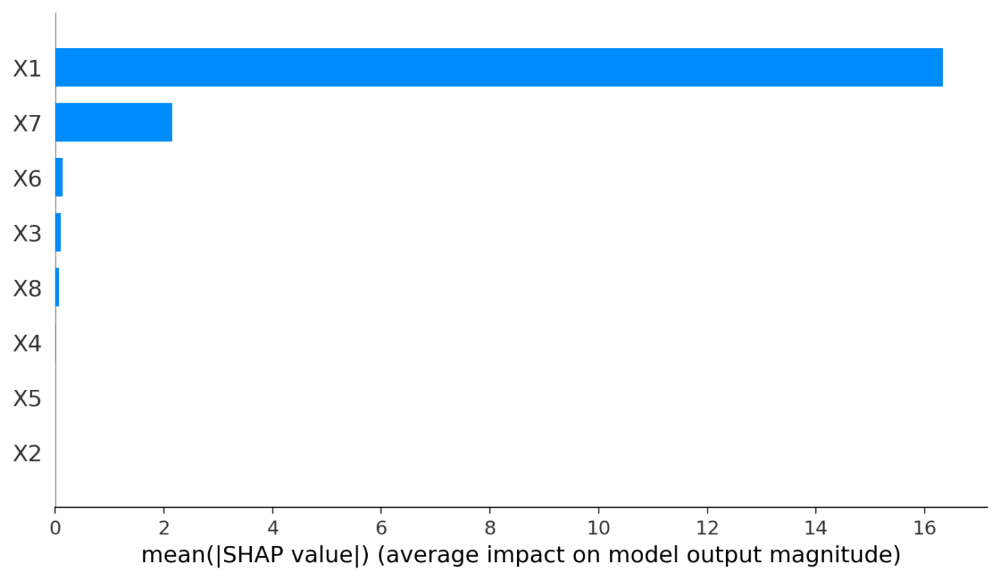

# Energy Efficiency Prediction

This Streamlit application predicts **Heating Load** and **Cooling Load** of buildings based on their characteristics using a machine learning model (XGBoost).

## Features
- Predict Heating and Cooling Load based on 8 building characteristics.
- Interactive user inputs for making predictions.
- Model explanation using SHAP values.

## Dataset
The dataset is sourced from the [UCI Machine Learning Repository](https://archive.ics.uci.edu/ml/datasets/Energy+efficiency).

## Installation
1. Clone this repository:
   ```bash
   git clone https://github.com/your-username/energy-efficiency-prediction.git
   cd energy-efficiency-prediction
2. Install the dependencies:
    ```bash
    pip install -r requirements.txt 
    ```
3. Run the application:
    ```bash
    streamlit run app.py
    ```
## Usage
1. Upload a dataset in data/ folder as data.csv.
2. Use the interactive Streamlit app to make predictions.
## SHAP Summary Plot
Below is the SHAP summary plot showing feature importance for the model:




**Contributing**

Feel free to fork this repository and create pull requests for enhancements.

## License

This project is licensed under the MIT License - see the [LICENSE](LICENSE) file for details.


